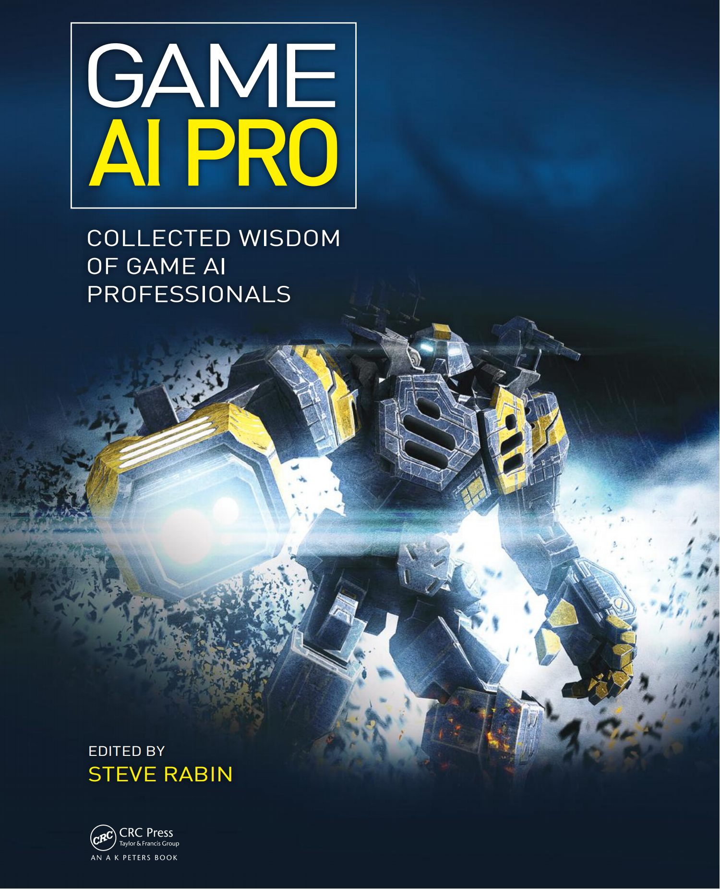

# Game AI Pro

## Preface

距离上一本类似书籍的问世已过去五年之久，这本新作的推出实属姗姗来迟。自 2008 年《AI 游戏编程智慧》系列丛书完结后，我们这些参与编撰的工作者将重心转向了构建游戏 AI 开发者社群 —— 通过成立 AI 游戏程序员协会 [www.gameai.com] 并在年度游戏开发者大会上组织 AI 峰会。尽管这些举措始终极具价值，但人们逐渐意识到行业仍存在某种缺失。

尽管网络信息的爆炸式增长似乎让技术书籍日渐式微，但您应该会认同：在游戏 AI 这样的专业领域，要找到高质量、系统化的专家知识依然困难重重。事实上，全球真正的游戏 AI 专家数量远少于其他领域 —— 过去五年间，AI 游戏程序员协会汇聚的专业开发者也不过 350 余人，即便全球总数再翻两番，这个群体依然堪称小众。正因如此，能有 54 位顶尖专家在此书中倾囊相授，实属难能可贵的馈赠，我对此深怀感激。

编纂这样一本书籍最令我珍视的，正是其产生的知识乘数效应。只需将技术方法与核心概念淬炼成铅字，某款游戏中获得的智慧就能惠及千百同行 —— 那些本可能湮没或需要重复探索的经验，得以在无数工作室与开发者脑海中传播生根。我们不必重复造轮，而是站在同侪的肩膀上继续攀登。

值得庆幸的是，这个领域终于沉淀出坚实的体系化知识。事必躬亲的蛮荒时代已然终结，如今我们能在行为树、效用理论等完备方法论上构建架构，运用耗费数十年才完善的路径寻找技术。然而前方仍有无数待解之谜与崭新航道，愿本书中的真知灼见能成为您需要的垫脚石，以及渴求的灵感火种。

Steve Rabin

## Section 1: General Wisdom

### 1. What is Game AI

> Kevin Dill

#### 1.1 Introduce

游戏 AI 应当且仅应当专注一个核心使命：赋能开发者，为玩家缔造震撼体验。我们采用的每种技术、设计的每个技巧、编写的每段算法，都必须服务于这一终极目标。

维基百科将人工智能（AI）定义为："智能代理体的研究与设计"，其中智能代理体指 "能感知环境并采取行动以最大化成功概率的系统"[Wikipedia 12-A]。这虽非唯一定义 —— "人工智能" 本就是难以精确定义的术语 —— 但它确实精准描述了当今高校教研体系中主流的 AI 范式。我们将沿用学术 AI 这一术语，指代当前教育领域普遍传授的 AI 知识体系。

电影动画师常将他们创造的人工生命称为 "生命的幻象"—— 这一说法据传源自华特・迪士尼。这与游戏 AI 的追求截然不同：卡通角色未必会 "采取行动以最大化成功概率"，比如怀尔・E・土狼就总在反其道而行。动画角色存在的意义，在于唤起观众对其真实性的本能信任（尽管它们明显是人造产物），并营造令人沉醉的体验 —— 这正是电影艺术的终极追求。

每款游戏都是独特的，其对 AI 的需求也千差万别。但总体而言，游戏 AI 的目标更贴近迪士尼对人工生命的理念，而非传统学术派的 AI 观点。与动画艺术相似，游戏创作的本质在于娱乐 —— 不在于追求成功最大化、认知建模或真实智能，而在于讲述故事、营造体验、创造智能的幻象 [Adams 99]。虽然某些情况下我们可以借鉴学术 AI 的技术来构建这种幻象，但更多时候需要另辟蹊径。我们将专注于营造智能表象、为玩家创造特定体验的 AI 称为游戏 AI，以区别于追求人类级别真实智能的学术研究。

#### 1.2 Creating an Experience

常言道，游戏 AI 的目标并非追求成功概率最大化，而是最大化玩家的乐趣。这固然可以作为 AI 的设计目标，但或许并非最佳定义。首先，"乐趣" 如同 "AI" 这个术语一样难以界定；其次，并非所有游戏都以趣味为核心 —— 有些旨在叙事，或塑造极具魅力的角色；另一些则致力于营造刺激、冒险、悬疑甚至恐惧（如恐怖电影般）的体验；还有的游戏追求赋予玩家掌控感，让其化身 "天选之人"。

但万变不离其宗的是：游戏的本质在于为玩家创造特定体验 —— 无论这种体验具体为何。游戏 AI（以及游戏所有其他组成部分）存在的意义，就是服务于这种体验塑造。因此，我们选用的技术手段只需完美呈现目标体验 —— 无需炫技，也绝不妥协。

##### 1.2.1 Suspension of Disbelief

玩家是我们所构建体验的主动参与者。他们自愿沉浸于我们编织的幻象，主动搁置对虚拟角色与事件本能的怀疑。正因如此，我们更有责任提供足够引人入胜的幻象 —— 即维系玩家的 "怀疑中止" 状态。当玩家像对待真实存在般与 AI 互动时（即便底层算法其实相当简单），我们就成功了；而当 AI 的某个行为（或不作为）提醒玩家这不过是段程序时，我们就失败了。约瑟夫・魏岑鲍姆 1964 年开发的 AI 心理医生 ELIZA [Wikipedia 12-B] 完美诠释了：简单算法如何轻易获得玩家信任，又如何在出错时瞬间瓦解这种信任。

由于玩家的主动参与性和人类思维的特性，他们实际上相当宽容。只要 AI 行为基本合理，玩家大脑会自动构建复杂解释 —— 往往比 AI 实际运算复杂得多 —— 但这些解释本质上令人信服。事实上，过度复杂的 AI 设计可能适得其反。这不仅会浪费宝贵的开发时间，更可能导致 AI 行为虽然自身逻辑完备，却与玩家的心理预期脱节。换言之，这些精心设计的决策在开发者眼中合情合理，但对无法知晓 AI 思考过程的玩家而言，最终呈现的可能是看似随机或完全错误的行动。

我们最需要避免的是人工愚蠢 —— 即 AI 做出明显不合理或毫无逻辑的行为。常见例子包括撞墙、卡在场景模型里，或对玩家攻击毫无反应。甚至某些人类会表现的行为，AI 角色做出来也会显得不自然。比如人类经常改变主意，但 AI 若这样做，往往会被认为是算法故障而非形势重新评估。

解决人工愚蠢的一个方法是提升 AI 能力 —— 但玩家预期千差万别，很难时刻满足所有要求。因此开发者采用了多种创新方案：在某些游戏（如僵尸题材）中，角色被刻意设计得有些笨拙，使其怪异行为更容易被接受；另一些游戏则让角色通过简短台词（称为 "喊话"）向玩家解释行为，比如大喊 "手雷！" 或 "我中弹了！"；还有游戏（如《模拟人生》《动物园大亨》）会在角色头顶显示图标，直观展现内部状态。以突破性 AI 闻名 15 年的游戏《Creatures》，甚至会在生物改变主意时显示 "困惑" 图标，表明行为变化是经过思考的。

##### 1.2.2 Reactivity, Nondeterminism, and Authorial Control

关于游戏 AI 架构的优劣之争从未停歇 —— 本书甚至专门开辟章节探讨这个话题。从学术 AI 角度出发，最直接的思路或许是：先定义期望体验的启发式规则，再通过机器学习优化实现。但这种方法存在明显缺陷：游戏设计师（未必是程序员）通常用模糊的人类语言描述体验目标，比如如何量化 "乐趣"" 刺激感 "或" 炫酷姿态 " 这样的抽象概念？

这并非否定启发式方法的价值。事实上，基于效用理论（utility-based）的 AI 架构已被广泛采用，尤其在需要复杂决策的游戏中（如策略游戏、《模拟人生》《动物园大亨》等模拟经营类）。但关键在于保持创作主导权 —— 即确保开发者能随时调整 AI 行为，精准达成设计目标。若将控制权完全交给机器学习算法，结果往往难以把控。

与此同时，我们还面临另一个核心需求：环境响应性。角色需要感知游戏世界，根据瞬息万变的局势做出细腻反应。响应性与创作主导权并非对立关系。通过构建受控的反应式系统 —— 即在决策过程中保留环境评估机制的控制权 —— 开发者既能保证角色灵活应变，又不失创作主导权。当然，调控响应式 AI 更为复杂：开发者必须预判每个调整会如何影响 AI 的决策逻辑，而非简单地直接修改行为结果。

这里没有唯一正确的答案。有些游戏（比如策略游戏或《模拟人生》这类游戏）需要更高的响应性，而另一些游戏（比如《魔兽世界》）则刻意设计采用更重度脚本化的 AI，为玩家提供精心打造 —— 但高度可预测 —— 的体验。两种方式都没有错 —— 每种类型都有出色的游戏 —— 但提供的体验是不同的，这正是选择 AI 方案时需要考虑的关键。）

游戏 AI 领域存在多种主流架构体系（本书后续章节将详细探讨），它们在响应性与控制权之间呈现不同的平衡特性。图 1.1 通过坐标轴大致展示了常见架构在这两个维度的分布情况。但必须强调的是：每种架构都有其独特的优势、局限与特性差异，该图表仅作为基础参考框架。

**Figure 1.1: 某些流行的人工智能架构在作者控制和反应性之间的权衡。**

需要特别说明的是，机器学习在图表中的位置仅反映其在学术界的流行程度——实际仅有极少数游戏将其用于核心AI系统。同时，行为树被刻意排除在该图表外，因为其表现高度依赖于所采用的决策组件类型：若全部使用Damian Isla最初设想的简单组件[Isla 05]，行为树的特性与有限状态机基本重合；但其强大之处在于每个节点都可嵌入最合适的决策逻辑，使得单一架构能融合多种决策范式。

选择AI架构时还需考虑非确定性因素。多数游戏需要为角色注入适量随机性，避免玩家预测（甚至利用）AI行为；但又要防止AI做出明显荒谬的选择，确保随机选项始终合理。某些架构（特别是行为树和基于效用的系统）能更优雅地处理随机性注入，这将成为您设计游戏时的又一关键考量维度。

##### 1.2.3 Simplicity and Scalability

在游戏 AI 开发中，创作可控性与人工愚蠢规避的双重要求，决定了配置过程必须采用迭代式开发。要让 AI 既能处理所有可能情境（至少是大概率情境），又能准确传达设计意图并呈现令人信服的行为表现，几乎不可能一蹴而就。开发者需要循环执行：测试→定位核心问题→修正→再测试的迭代流程。

Unix 系统和 C 语言共同开发者 Brian Kernighan 有句名言："调试的难度是编写代码的两倍。因此，若你竭尽所能写出最精巧的代码，按定义就意味着你已没有足够智慧来调试它"[Kernighan]。这条定律对游戏 AI 尤甚 —— 任何代码修改都可能引发蝴蝶效应：此处修复的 bug 或平衡性问题，可能在彼处引发更隐晦的新问题。基础算法越简洁，开发者越能在脑中构建完整的心智模型，从而更精准预判修改的连锁反应，实现更安全高效的开发，最终打磨出更精致（且更 "有趣"）的游戏体验。

观察游戏领域常用决策算法（有限状态机、脚本系统、行为树、权重随机、目标导向行动规划等），其核心算法本身都极其简洁。虽然基于这些框架构建的配置可能非常复杂，但底层代码始终保持着简单、易理解、易追踪调试的特性。

但需注意一个关键限制：许多简单算法（以有限状态机为典型代表）会随 AI 复杂度提升而急剧劣化。例如状态机的转移条件数量会随状态数呈指数级增长，很快变得难以维护。因此，真正优雅的架构必须兼具概念简洁性与工程扩展性 —— 既要易于理解，更要能优雅地应对规模增长。

##### 1.2.4 Tricks and Cheats

关于游戏 AI 是否 "作弊" 的争议从未停歇，但业界对 "作弊" 的界定标准却莫衷一是。赋予 AI 角色略高于玩家的基础属性算作弊吗？若通过道具系统合理化这种加成呢？在策略游戏中为 AI 提供经济加成（使其以更低成本生产单位）是否越界？倘若允许玩家自行选择加成幅度并称之为 "难度等级" 呢？

暴雪策略游戏 AI 负责人 Bob Fitch 透露的轶事颇具启示性 [Fitch 11]：初代《魔兽争霸》的战役 AI 会固定时间后在战争迷雾边缘（即玩家视野外）刷兵，持续生成部队直至玩家防线濒临崩溃，然后突然停手 —— 既营造出史诗级战役的紧张感，又确保玩家最终险胜。这种设计显然踏入了 "作弊" 领域：AI 无需考虑建筑布局、资源管理或兵种训练，直接凭空生成单位。但从体验设计角度看，它精妙地实现了动态难度平衡：无论玩家水平高低，都能获得逼临极限却又终将胜利的巅峰体验。

这种 "作弊" 机制的阴暗面在于：其魔法效应完全建立在玩家不知情的前提下。一旦玩家识破机关，精心设计的体验就会瞬间崩塌 —— 没有人喜欢被施舍的胜利。遗憾的是，如今，特别是随着互联网的出现，玩家比 1994 年更难被愚弄（也更难被原谅）。

另一种 "作弊" 则纯粹关乎信息获取 —— AI 是否需要实际感知单位才能确认其存在与位置？问题在于：虽然视线检测（line-of-sight）的技术实现很简单，但记忆已见单位并预测其动向却困难得多。当单位离开视野后，AI 该如何维持其存在认知？如何推测其可能位置？当同类单位再次出现时，如何判断是原有单位还是新增单位？人类擅长这种基于对手建模、直觉与推测的认知行为，而这恰是计算机的先天短板。

然而对多数游戏类型而言，AI 必须拥有预测资源分布、敌军实力与部署的能力。玩家若判断失误会遭遇失败，但 "资源勘探失败" 或 "战术被识破" 这类败因往往能激发再战欲望；反之若 AI 犯此类错误，玩家将轻松获胜，继而产生 "这 AI 真蠢" 的负面评价 —— 精心设计的挑战体验便彻底瓦解。

最终是否允许 AI"作弊" 的决策标准其实很明确：当且仅当能提升玩家体验时可以采用。但需警惕 "作弊穿帮" 带来的反效果。以获誉无数的 RTS《Kohan 2》为例，其 AI 设计包含两项精妙的隐蔽作弊：首先，探索阶段每 30 秒给予 AI 一次随机机会，引导其勘探已知资源区，避免因运气因素陷入资源匮乏；其次，仅记录区域的敌军总量而非具体位置，使攻防兵力调配更合理，避免无意义追击。这些设计从未被评测者识破，反而被认为展现了卓越的智能 —— 正如前文所述，最成功的 AI 作弊，其效果往往被误认为高级智能的体现。

#### 1.3 Conclusion

学术 AI 可以涉及诸多领域。它可能致力于解决难题、重现人类智能、通过模拟人类认知来探索大脑运作机制、优化复杂操作环境下的性能表现（例如自主机器人），或是其他极具挑战性且富有价值的追求。所有这些课题都艰巨而值得研究 —— 但适用于它们的解决方案未必适用于游戏。

游戏 AI 应当且仅应当专注于一件事：让开发者能够为玩家创造引人入胜的体验 —— 这种体验将让玩家愿意投入时间游玩，愿意购买资料片和续作，而如果你成功了，这些结果必将随之而来。

本书的其余部分充满了经过我们行业验证的技巧、窍门、技术和解决方案。游戏开发周期紧张，容错空间极小，如果在发行时 AI 运作不正常，几乎没有延期的机会。此外，仅仅是为游戏构建一个引人入胜的 AI 就已是足够大的挑战。我们既没有时间，也没有兴趣去解决那些不必要解决的难题，或是重新发明已经存在的解决方案。带着这些挑战，希望书中提供的一些方法也能对你有所帮助。

#### Reference

[Adams 99] E. Adams. “Putting the Ghost in the Machine.” Lecture, 1999 American Association for Artificial Intelligence Symposium on Computer Games and AI, 1999.

[Fitch 11] B. Fitch. “Evolution of RTS AI.” Lecture, 2011 AI and Interactive Digital Entertainment Conference, 2011.

[Isla 05] D. Isla. “Handling complexity in the Halo 2 AI.” 2005 Game Developer’s Conference, 2005. Available online ([http://www.gamasutra.com/view/feature/130663/gdc_2005_proceeding_handling_.php]).

[Kernighan] B. Kernighan. Original source unknown. Available online ([http://www.software-quotes.com/printableshowquotes.aspx?id=575]).

[Wikipedia 12-A] Wikipedia. “Artificial Intelligence.” Available online ([http://en.wikipedia.org/wiki/Artificial_intelligence], 2012).

[Wikipedia 12-B] Wikipedia. “ELIZA.” Available online ([http://en.wikipedia.org/wiki/ELIZA,2012]).

## Section 2: Architecture

## Section 3: Movement and Pathfinding

## Section 4: Strategy and Tactics

## Section 5: Agent Awareness and Knowledge Representation

## Section 6: Racing

## Section 7: Odds and Ends
